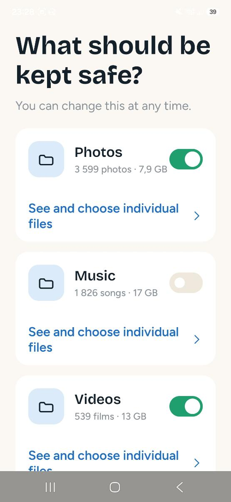
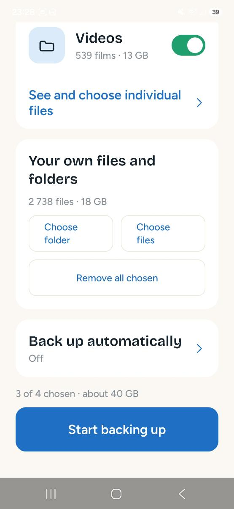
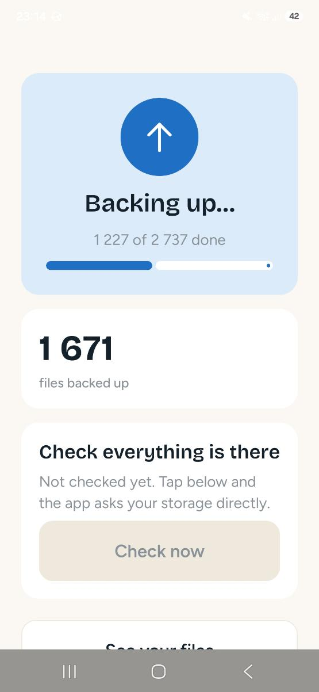

# MWM Cloud

An Android app that backs up a phone's photos, music, video and documents to
storage you own, lets you watch and read them again from inside the app, and then
tells you honestly whether any of it actually worked.

It is built against [Hetzner Storage Box](https://www.hetzner.com/storage/storage-box/),
roughly EUR 3.20/month for 1 TB with unlimited traffic, which speaks WebDAV and
SFTP rather than a proprietary client. Nothing above one `Transport` implementation
knows that, so any WebDAV host works today by typing its address.

**Status: in daily use, and honest about what it is.** Running against a real box
with about 6 700 files and 50 GB on it. You can connect it, choose exactly what
goes and what stays, have it run weekly on its own, then browse the result as a
photo grid, play a film, and ask the server to confirm file by file that your
copies are really there. Household invite codes are not built. See [Roadmap](#roadmap).

## Download

**[Get the APK](https://github.com/Matswm86/mwm-cloud/releases/download/latest/mwm-cloud-84b8e02.apk)**
&nbsp;·&nbsp; [all builds](https://github.com/Matswm86/mwm-cloud/releases)

Open the link on your phone, tap the file, and allow "install from this source" when
it asks.

The filename carries the build id on purpose, so your phone can never serve you a
stale cached APK. If the link 404s, a newer build has landed: grab the newest
`mwm-cloud-*.apk` from the releases page.

## What it looks like

Screenshots of the running build on a real phone, backing up a real library.

| What should be kept safe | Your own files, and the schedule | Backing up, and checking it |
|---|---|---|
|  |  |  |

Every number on these screens was read from the phone or the server. None of them
are placeholders.

## Why this exists

Off-the-shelf sync clients can already move files to a WebDAV server. They are built
for people who enjoy configuring sync clients. This one is built for the person who
just wants their photos to still exist in ten years, and who has been paying a
monthly subscription for storage they never chose and cannot audit.

Buttons are 68 dp tall, nothing renders below 15 sp, and the interface is Norwegian
first. Those are not preferences. The person this is for is often in their
seventies, holding the phone at arm's length, and has been told for years that
backup is something they are too old to understand.

Five consequences shape every decision here:

- **The app never deletes anything from your phone.** There is no delete-local code
  path, in any version. Freeing space is a manual decision you make after you have
  seen a restore work.
- **Counts are verified against the server, not asserted.** "1204 of 1204 backed up"
  comes from listing the remote and comparing, not from counting successful uploads.
  An upload that succeeded and a file that is actually there are different claims.
  When the check finds a gap, it can drop those ledger rows and queue the files
  again, so finding a problem and fixing it are one action.
- **Getting your files back never means leaving the app.** A storage box does serve
  a plain directory index in a browser, and that still works as a fallback, but it
  looks like an FTP listing and it asks the user to understand URLs. Photos, video
  and music open inside MWM Cloud instead, and any one of them can be put back on
  the phone with one button, or a whole month at a time.
- **A file put back goes into the phone's own folders, not the app's.** Restored
  photos land in `Pictures/MWM Cloud/2026/08/`, video in `Movies/`, music in
  `Music/`, everything else in `Download/`. They appear in the gallery and they
  survive uninstalling this app. A file that only exists inside the app that
  fetched it has not really come back.
- **"Everything" and "only these" are different requests, and stay different.** A
  category set to *everything* stores what you ticked off, so a photo taken
  tomorrow is covered without being asked about. A category set to *only what I
  pick* stores what you ticked on, and never adopts anything new. Guessing between
  those is how a backup either misses new photos or quietly grows to 40 GB.
- **A failure that cannot be diagnosed is never reported as data loss.** When the
  check cannot read the server's answer it says the check failed. It does not say
  your files are missing. That distinction cost a real scare to learn: a parser
  fault made every listing unreadable, and the panel reported 444 files that were
  sitting safely on the box as gone.

## How it works

```
  On the phone                                          Your storage
  ----------------------------------------              ------------
  MediaStore  ─┐
  System picker ┴─> Selection ──> upload ledger
                    (all / only-picked, per category)
                         │
                    WorkManager        manual, or every day/week/month
                    (wifi only, battery-aware, resumes across runs)
                         │
                    Transport ─── PUT / MKCOL / PROPFIND ───> /Bilder/2026/08/…
                         │                                     /Musikk /Video /Valgt
                    Verifier  ─── PROPFIND, compare sizes ───> what is really there
                         │
                    Viewer    ─── GET with ranges ──────────> photos, film, music
                         │
                    Downloader ── GET ──> MediaStore ───────> Pictures/MWM Cloud/…
                    (one file now, or a folder via WorkManager)
```

Media is filed by year and month so no remote folder grows into the thousands and a
month is one request. Files you pick by hand keep the folder shape you chose, under
`/Valgt`, because that is the shape you will look for when you want them back.

**Seeing your files never requires uploading anything.** The file screen reads the
server directly, so a fresh install pointed at an existing box can browse and play
everything on it without backing up a single byte first.

## Build

Requires JDK 17. Everything else comes from the Gradle wrapper.

```bash
git clone https://github.com/Matswm86/mwm-cloud.git
cd mwm-cloud
./gradlew :app:assembleDebug
```

The APK lands in `app/build/outputs/apk/debug/`.

CI builds every push and publishes a signed APK to
[Releases](https://github.com/Matswm86/mwm-cloud/releases). Set the repository secret
`ANDROID_DEBUG_KEYSTORE_BASE64` (base64 of a `debug.keystore`) so the signature stays
stable across builds and updates install over the previous version. Without it, CI
generates a throwaway key per build and you will have to uninstall before updating.

### Pointing a build at your own backend

The backend URL is never committed. Add to `local.properties` (untracked):

```properties
mwmcloud.backendUrl=https://your-host.example.com
```

Builds without it default to `https://cloud.example.com`, which does not resolve.

## Which storage this works with

Any host that speaks WebDAV works **today**: type its address, username and
password on the connection screen and the app treats it like any other. That covers
Nextcloud and ownCloud, Synology and QNAP boxes, Infomaniak kDrive, Koofr,
Mailbox.org, Fastmail files, and self-hosted rclone or Apache `mod_dav`.

What is **not** supported, and what each would actually take:

| Kind | Examples | What is needed |
|---|---|---|
| WebDAV | the list above | nothing, it works now |
| S3-compatible | Backblaze B2, Wasabi, Cloudflare R2, Storj, iDrive e2, Scaleway, MinIO | one new `Transport`, roughly the size of the WebDAV one. Multipart upload comes with it, which is also what lifts the 5 GB per-file limit |
| SFTP | any box with SSH, including this one | one new `Transport`. Gives resumable transfers and a real free-space figure, which WebDAV cannot report |
| Consumer clouds | Google Drive, Dropbox, OneDrive, iCloud | genuinely large, and mostly not code: each needs its own developer account, OAuth client, redirect scheme, and in Google's and Apple's case a review before the scopes work outside a test user list. One vendor at a time, not a list |

So "pick your provider from a list" is two different jobs. A menu over WebDAV and
S3 hosts that fills in the right address template is small and would cover a few
dozen providers. Adding the four big consumer clouds is a per-vendor commitment
with paperwork attached, and it changes who is responsible when a login breaks.

## Setting up a Hetzner storage box

1. Order a Storage Box. The 1 TB tier is enough for most phones.
2. Enable, in the provider console:
   - **external reachability** — required, or phones cannot connect from outside the provider's network
   - **WebDAV** — the app's transport
   - **SSH** — optional, for your own `rsync`/`rclone` access
   - leave **Samba** off
3. Turn on automatic snapshots. They are the second line of defence if a client ever
   deletes something it should not have.

Known limits worth planning around: a box allows up to 100 sub-accounts and 10
simultaneous connections per account, which is why members of a household can share
one box without seeing each other's files. WebDAV cannot report free space at all,
so a quota figure has to come over SFTP.

## Design

Design tokens live in `app/src/main/java/no/mwmai/mwmcloud/ui/theme/Theme.kt` and are
the only place colour literals appear. Reference assets are in `design/`.

| Token | Value | Use |
|---|---|---|
| Action | `#1F6FC4` | buttons, progress, active tabs |
| Safe | `#1F9E6E` | everything is backed up |
| Attention | `#E4A11B` | needs the user to act (never errors) |
| Text | `#14212B` | |
| Background | `#FBF8F3` | |
| Border | `#EFE8DD` | |
| Action tint | `#DCEBFA` | surfaces behind action-coloured content |
| Muted | `#8A9299` | secondary text, never below 15 sp |

Headings are Bricolage Grotesque 600/700, body is Figtree 400/500/600. Buttons are
68 dp tall and no text renders below 15 sp. Those are legibility requirements rather
than preferences: the intended user is often someone in their seventies holding the
phone at arm's length.

Norwegian and English, and you can choose. The Norwegian strings are the original
and the English are the translation, not the other way round, but Android alone
only reaches the Norwegian ones when the entire phone is set to Norwegian. That
left a Norwegian speaker with an English phone looking at an English app and no way
out of it, so there is a language choice under "Where are my files?".

## Roadmap

- [x] Project scaffold, design tokens, CI
- [x] WebDAV transport and encrypted credential store
- [x] Media enumeration, upload ledger, background upload
- [x] Welcome, connection setup, folder picker, home screen
- [x] Documents and anything else, via the system folder and file picker
- [x] Reconcile against the server, so the counts are checked and not just asserted
- [x] In-app file browser: month-grouped listing, photo viewer, video and music player
- [x] In-app help explaining where the files went and what the app will not do
- [x] Per-file picker with thumbnails, sort by date or size, search, select all
- [x] Per-category choice between "everything" and "only what I pick"
- [x] Scheduled automatic backup, with its own list of what it covers
- [x] Browse and play what is on the server without backing anything up first
- [x] Put files back on the phone: one file, or a whole month in the background
- [ ] First-run walkthrough with a visible confirmation at each step
- [ ] S3-compatible transport, which also brings multipart upload
- [ ] A provider picker over the WebDAV and S3 hosts that need no OAuth
- [ ] Resumable uploads over SFTP, which is what would lift the 5 GB per-file limit
- [ ] Provisioning service and invite codes for households

Current limits worth knowing: single files above 5 GB are skipped and reported,
because WebDAV `PUT` cannot resume a broken upload. The box serves no thumbnail
API, so the photo grid downloads full images and downsamples them on the device;
Coil's disk cache keeps that to one fetch per photo per install.

## Licence

Not yet chosen. Until one is added, no permission to reuse is granted.
